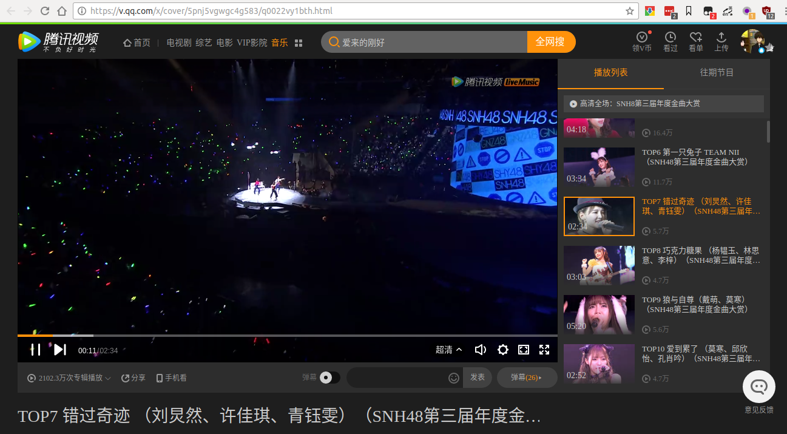

# disflash
disflash —— 关掉 flash 计划

## 介绍
disflash 计划是希望在关掉 flash 或者浏览器默认不再提供 flash 的时候还能浏览国内的视频网站的视频。

*暂时只在 Chrome 里测试过。*

目前已支持：

* 优酷
* 腾讯视频
* Bilibili 直播
* AcFun
* 音悦台
* 搜狐视频
* 正在添加各大视频网站……

## 使用

**需要 Python 3 。**

### ① 安装依赖
把 disflash clone 到本地，进入项目文件夹。
```
pip3 install -r backend/requirements.txt
```

### ② 安装 Tampermonkey 脚本

在 Chrome 里安装 Tampermonkey 插件。在 Tampermonkey 里新建脚本，
把 [monkey_script.js](https://github.com/sljeff/disflash/blob/master/monkey_script.js) 的内容复制到代码框里，保存即可。

### ③ 运行 server
然后运行：

```
python3 backend/main.py
```

> 为了能在 https 的页面里执行脚本，server 是 https 的。所以需要把 `backend/rules/__gen_cer/dfRootCA.pem` 添加到浏览器受信任的机构的证书里。

### ④ 然后打开已支持的视频网站看看效果吧。

## 截图




## 如何扩展 disflash
比如，需要给优酷编写规则，那么需要：

**① 在 `backend/rules/` 里新建一个文件夹**。

里面包含 `__init__.py` 文件。我把文件夹命名为 youku ，那么文件目录是：
```
backend/
--------rules/
--------------youku/
--------------------__init__.py
```
**② 然后编写 `__init__.py` 。**

需要实现两个方法：`script` `proxy`。

`script` 方法需要是一个tornado 协程，所以必须：
```python
from tornado.gen import coroutine, Return
```

**函数如下：**
```python
@coroutine
def script(url_path, request_handler):
    """
    :type url_path: str
    :type request_handler: tornado.web.RequestHandler
    :rtype: bool
    """
    if is_url_match_this_rule(url_path):  # 如果 URL 是匹配的
        # 可以从 request_handler 得到需要的信息
        get_info_from_request_handler(request_handler)
        # 返回一个 js。浏览器端会执行这段 js
        request_handler.write(javascript)
        yield request_handler.flush()
        # 返回 True，告知程序已经匹配到了，不会再去匹配其他的规则。
        raise Return(True)
    else:
        # 返回 False，程序会继续遍历下一个规则
        raise Return(False)
```

`proxy` 函数会被运行在一个单独的线程里。

**函数如下：**

```python
def proxy(url_path, request_handler):
    """
    :type url_path: str
    :type request_handler: tornado.web.RequestHandler
    :rtype: bool
    """
    if is_url_match_this_rule(url_path):  # 如果 URL 是匹配的
        # 可以从 request_handler 得到需要的信息
        get_info_from_request_handler(request_handler)
        # 可以修改要返回给浏览器的 HTTP 头
        request_handler.set_header('Content-Type', 'video/mpeg4')
        request_handler.set_header('Transfer-Encoding', 'chunked')
        # 通过一些办法拿到视频数据并且发送
        for chunk in video.iter_content(2048):
            if not chunk:
                break
            request_handler.write(chunk)
            request_handler.flush()
        request_handler.finish()
        # 返回 True，告知程序已经匹配到了，不会再去匹配其他的规则。
        return True
    else:
        # 返回 False，程序会继续遍历下一个规则
        return False
```

**③ 在 Tampermonkey 的内容，前面的注释里加入匹配规则**

```
// @match     http://v.youku.com/v_show/*
```
做完这一步就完成了一个规则的添加。

**disflash 的逻辑是这样的：**

* 打开 Tampermonkey 脚本里已经写好的匹配规则的页面，Tampermonkey 脚本被执行。它会尝试获取 `'https://localhost:9527/getscript/' + window.location.href`，然后执行返回的 js 脚本。

* `'https://localhost:9527/getscript/***'` 让 server 遍历调用各个规则的 script 方法。然后匹配到的规则会返回一个 js 脚本给浏览器，浏览器会执行它。

* 一些不算严格的网站只需要这个脚本就可以看到视频了；另一些网站需要用 server 作为代理获取视频。所以在可以给它们返回的 js 内容里包含对 `'http://localhost:9527/proxy/***'` 的请求。可能在获取了一些页面上的信息之后，让它对 `'https://localhost:9527/proxy/***'` 发起请求。

* `'https://localhost:9527/proxy/***'` 让 server 遍历调用各个规则的 proxy 方法。（所以每个规则必须包含一个 proxy 方法，如果这个网站不需要用到，也要有一个 `return False`）

* 对于所有的请求的返回，disflash 都会默认添加上各种 Access-* 的头让浏览器不会拒绝它；对于 OPTION 请求，disflash 会返回 200 OK；对于 `/getscript/***` 请求的返回，会把 Content-Type 设为 application/javascript。所以不需要在规则的 `script` `proxy`里修改这些头。

## 另

做 disflash 的想法是来源于 [MAMA2](https://github.com/zythum/mama2) 。
> 为什么不用 MAMA2 或者给 MAMA2 写扩展?

> ① MAMA2 已经有些时间没更新了，部分网站已经失效。
一些失效的原因，比如搜狐视频，其实不是视频地址爬取失败了，而是返回 HTTP 头的 `Access-Control-Allow-Origin` 没有包含 PC 页面，
浏览器安全机制拒绝了它。
还有一些是另外的安全机制，比如复杂请求前给跨域的地址发送 OPTION 的 preflight 请求，会被视频源拒绝。这需要一个运行的 server 来做
（如果 MAMA2 没有缺省解析服务的话，是需要跑一个 server 的，而这个 server 只用来返回播放器和播放地址，功能比较受限）。

> ② 一些网站比如音悦台/腾讯视频的 PC 版已经自带 HTML5 播放器了，而且音悦台只需要一个跳转即可。
不过腾讯视频需要在视频的部分载入前让浏览器的 UA 是 Mac 的 safari，这也是 MAMA2 做不到的（因为 MAMA2 就是给 Mac 用户用的……）。

> ③ node 平台的各种包依赖问题让编写 MAMA2 变得很难受……

所以 disflash 需要前后端共同配合来得到视频内容。对于比较严谨的网站（比如视频地址的`Access-Control-Allow-Origin`不是`*`的……），
浏览器端执行网页里的 JS ，并且加入 Tampermonkey 脚本用来做一些受浏览器限制的事；
服务端通过代理的方法可以模拟手机端以及解决跨域的问题。

disflash 有一个 tornado 的简单 server ，而复杂的逻辑都交给规则（backend 里的 rules 文件夹）。
这些规则是 Python 文件，所以它可以做任何事情。
